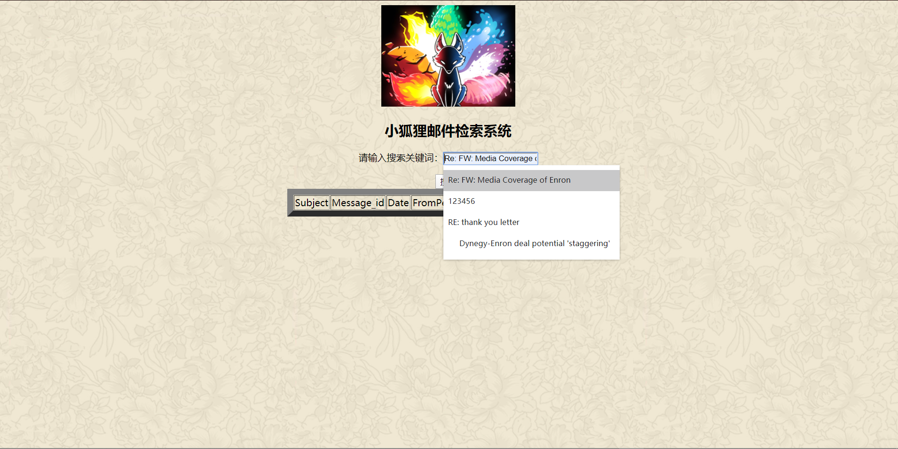
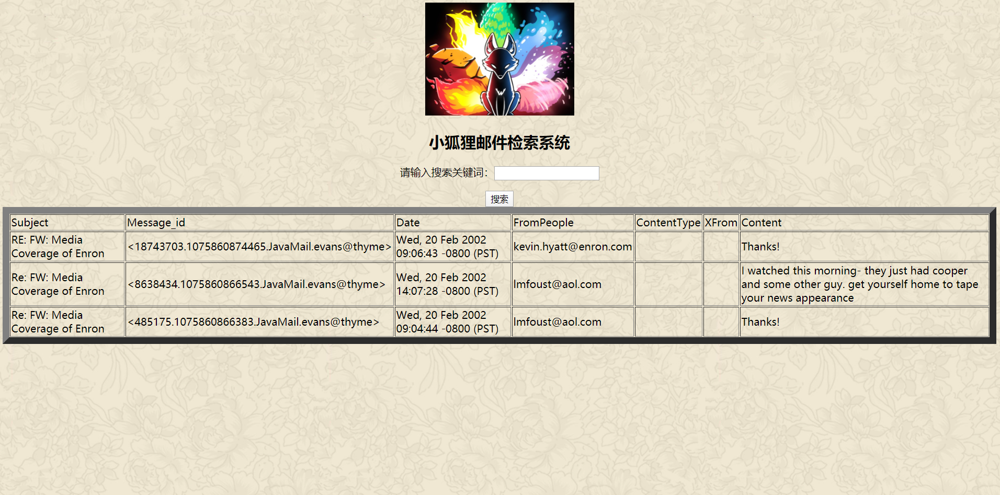
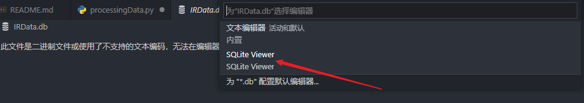
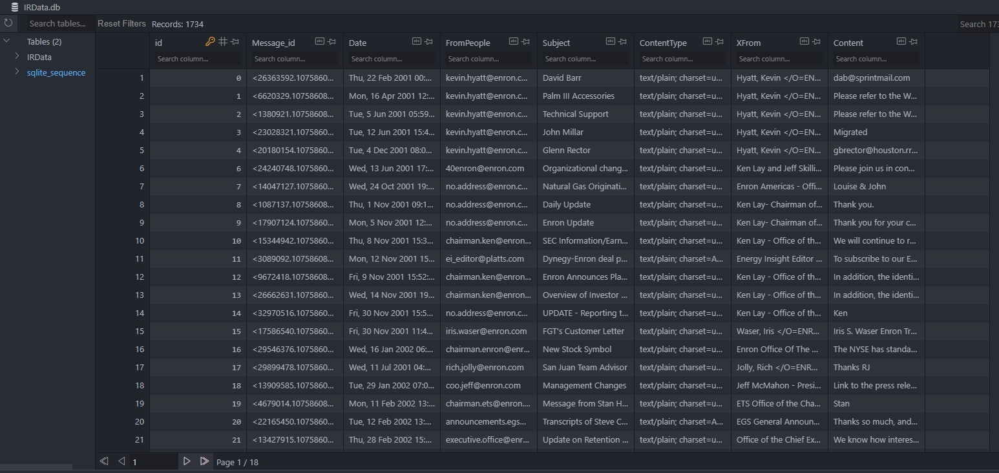

## 项目介绍

本项目使用python + flask搭建的邮件检索系统，其中邮件数据来自邮件数据集（hyatt-k数据集），项目实现的主要流程：

- 读取数据集的数据存入数据库中，首先分析 hyatt-k 数据集，数据存放在TXT文件中，不利于后续索引的建立，因此将数据逐条读取出来，存放到SQLite数据库中，而选择SQLite数据库的原因是轻量化，避免复杂的连接问题。在读取数据时用到了re正则匹配，进行数据的读取，读取后的数据存放在IRData.db下。

- 利用Whoosh建立邮件数据的索引，数据索引建立存放在index文件夹下。

- 使用建立的索引进行邮件的检索，其中将邮件的标题（Subject）作为检索的关键字。

- 将检索结果通过界面渲染出来，检索系统的搭建使用Flask框架，能够更简单的将检索功能嵌入到系统中。其中检索结果包括：

  Subject、Message_id、Date、FromPeople、ContentType、XFrom、Content

**项目目录**

```
IR_project
├─index	  数据索引文件
│	
├─IR	  项目核心程序
| | ├─_pycache_					
| | ├─hyatt-k            邮件txt数据
| | ├─static             静态资源，包含界面的背景图等资源
| | ├─templates          界面文件
| | | └─index.html       前端检索页面
| | ├─index_craete.py    创建数据索引
| | ├─processingData.py  处理邮件TXT数据,导入到sqlite数据库中
| | ├─run_server.py      运行检索系统，启动界面服务，进行检索（可视化）  
| | ├─search_index.py    使用index索引，返回检索结果
| | ├─search_dict.py     使用布尔索引，返回检索结果
├─IRData.db	             邮件数据库
└─README.md              项目介绍
```

## 项目依赖

**项目开发环境**

- **VS Code**

- **python 3.7.0**
- **Windows**


**项目依赖库**

| 库名称   | 版本号 |
| -------- | ------ |
| whoosh   | 2.7.4  |
| numpy    | 1.21.4 |
| flask    | 2.0.2  |
| nltk     | 3.6.5  |
| pandas   | 1.1.5  |
| textblob | 0.17.1 |

## 项目预览

**未输入检索信息时**


**输入检索关键字**



**检索结果渲染**



**更新后的界面**


## 项目搭建

1. 运行`processingData.py`，将TXT数据处理到SQLite数据库，需要注意一点，需手动切换文件的路径，文件路径使用绝对路径。

   ```python
   if __name__ == "__main__":
   
     ## 定义文件目录
     path = "yoururl\\IR_project\\IR\\hyatt-k\\projects\\tsunami" #文件夹目录
     files= os.listdir(path) #得到文件夹下的所有文件名称
     dbpath = "IRData.db"
   ```

2. 安装SQLite Viewer插件，查看数据库中的数据是否处理生成。

   

   

3. 运行`index_craete.py`    创建数据索引。

4. 运行`run_server.py`  运行检索系统，启动界面服务，进行检索（可视化）。

## 作者解答

如有任何疑问，可添加作者微信，进一步了解项目。


